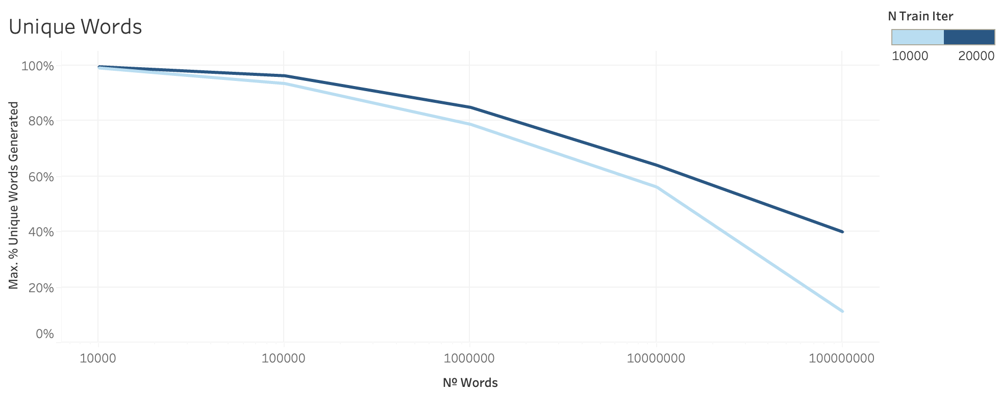
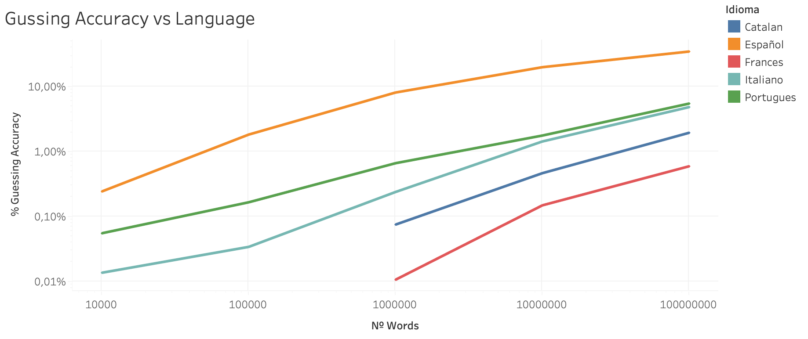

# LenguageGAN

Este repositorio contiene la práctica final de texto de la asignatura datos no estructurados. en ella se ha implementado hoy un modelo de texto generativo mediante el uso de GANs con el objetivo de generar palabras nuevas de un idioma. 

Para ello se ha entrenado primero la GAN con el lenguaje español. Después, se han probado a generar palabras nuevas y midiendo cuantas de esas palabras nuevas se encuntran en el conjunto de test, es decir, son palabras qué verdaderamente existen.

El proyecto está basado en las implemntaciones de GNPassGAN y PassGAN con la implementación de [Gradient Normalization](https://github.com/basiclab/GNGAN-PyTorch) en Pytorch 1.10.

El modelo utilizado en PassGAN está inspirado en el artículo [Improved Training of Wasserstein GANs](https://arxiv.org/abs/1704.00028) y su versión pytorch [improved_wgan_training](https://github.com/caogang/wgan-gp).

## Instalar dependencias

```bash
# requiere que CUDA 10 esté preinstalado
python3 -m venv .venv 
source .venv/bin/activate  
pip3 install -r requirements.txt
```

## Dataset

Se ha usado como dataset para entrenar el modelo las palabras en español descargadas de https://github.com/JorgeDuenasLerin/diccionario-espanol-txt.

Como conjunto de test se ha usado una fuente distinta, los diccionarios descargados de https://github.com/titoBouzout/Dictionaries. Estos diccionarios de distintos idiomas se han tenido que preprocesar para prepararlos para usarlos en la evaluación del modelo. Este preprocesado se ha realizado con el netebook `preprocesar_dic.ipynb`.


## Código

El código para entrenar el modelo, generar las contraseñas y analizar el accuracy es `run_in_colab.ipynb`. En el se realizan las llamadas para realizar los siguientes pasos:

#### Entrenar el Modelo

```python
!python3 './models.py' --training-data '{training_data}'  --output-dir '{output_dir}' --iters '{n_iters}'`
```

#### Generar Contraseñas

```python
!python3 './sample.py' --input-dir '{model_trained_dir}' --output '{generated_passwords}' --num-samples '{n_passwords}' --training-iters '{n_trained_iters}'
```

#### Calcular Accuracy

```python
!python3 './accuracy.py' --input-generated '{generated_passwords_file}' --input-test '{training_file_path}' --n-passwords-vec {n_passwords_vec}
```


## Resultados

El codigo creado para analizar y genrar las gráficas se encuentra en el notebook `read_logs.ipynb`.

El porcentaje de palabras generadas qué se encuentren en el conjunto de test se tomará como el accuracy. Hay qué apuntar qué no se puede esperar un 80% - 90%, por ello es razonable es conseguir entono a un 5% ya qué esto significa qué se han generado aleatoriamente 5% de las contraseñas qué no se han usado para entrenarlo.








